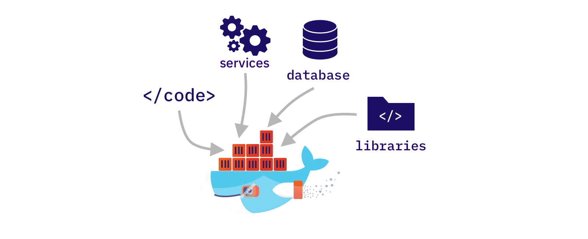

# Docker Notes
    

## What is docker?

Docker is an open platform for developing, shipping, and running applications. Docker enables you to separate your applications from your infrastructure so you can deliver software quickly. With Docker, you can manage your infrastructure in the same ways you manage your applications. By taking advantage of Docker's methodologies for shipping, testing, and deploying code, you can significantly reduce the delay between writing code and running it in production.

## Why do we need docker?

Docker helps us to easily mange containers. With the help of container we need build,test and deploy our app easily and quickly. 

## What is Image in docker?

A Docker image is **a read-only template that contains the application code, runtime, system tools, libraries, and dependencies needed to run an application**. It's a blueprint for creating Docker containers, which are isolated instances of an application and its environment.

## what is container in docker?

A container is a jailed Linux system. With the help of chroot, Namespaces and cgroups we can divide our host system into smaller secure systems with their libraries. Each Sub System can’t see what other sub-system or host is doing and only utilises the resources allocated to it.
