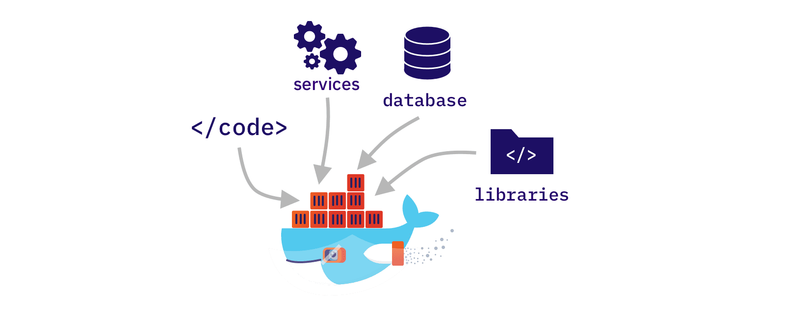

# Docker Notes



## What is docker?

Docker is an open platform for developing, shipping, and running applications. Docker enables you to separate your applications from your infrastructure so you can deliver software quickly. With Docker, you can manage your infrastructure in the same ways you manage your applications. By taking advantage of Docker's methodologies for shipping, testing, and deploying code, you can significantly reduce the delay between writing code and running it in production.

## Why do we need docker?

Docker helps us to easily mange containers. With the help of container we need build,test and deploy our app easily and quickly.

## What is Image in docker?

<center>

</center>

A Docker image is **a read-only template that contains the application code, runtime, system tools, libraries, and dependencies needed to run an application**. It's a blueprint for creating Docker containers, which are isolated instances of an application and its environment.

## what is container in docker?

<center>

</center>

A container is a jailed Linux system. With the help of chroot, Namespaces and cgroups we can divide our host system into smaller secure systems with their libraries. Each Sub System can’t see what other sub-system or host is doing and only utilises the resources allocated to it.

## Installation

### Prerequisites

- Docker installed on your system
- Node.js and npm (for local development)
- Bun runtime (for the example app)

### Local Development Setup

```bash
# Clone the repository
git clone <repository-url>
cd docker-notes

# Navigate to the example app
cd examples/node-app

# Install dependencies
bun install

# Run the application
bun run src/index.ts
```

### Docker Setup

```bash
# Build the Docker image
docker build -t node-app .

# Run the container
docker run -p 3000:3000 node-app
```

### Docker Compose Setup (Recommended)

```bash
# Navigate to the example app
cd examples/node-app

# Start all services (PostgreSQL + Node.js app)
docker-compose up -d

# View logs
docker-compose logs -f

# Stop all services
docker-compose down

# Stop and remove volumes (clears database data)
docker-compose down -v
```

## Docker Commands

### Basic Docker Commands

```bash
# List all images
docker images

# List running containers
docker ps

# List all containers (including stopped)
docker ps -a

# Remove a container
docker rm <container-id>

# Remove an image
docker rmi <image-id>

# Stop a running container
docker stop <container-id>

# Start a stopped container
docker start <container-id>

# View container logs
docker logs <container-id>

# Execute commands in running container
docker exec -it <container-id> /bin/bash
```

### Docker Container & Image Commands

#### Building Images

```bash
# Build image from Dockerfile
docker build -t <image-name> .

# Build with specific tag
docker build -t <image-name>:<tag> .

# Build from specific Dockerfile
docker build -f <dockerfile-path> -t <image-name> .
```

#### Running Containers

```bash
# Run container in detached mode
docker run -d -p <host-port>:<container-port> <image-name>

# Run with environment variables
docker run -e NODE_ENV=production -p 3000:3000 <image-name>

# Run with volume mounting
docker run -v <host-path>:<container-path> <image-name>

# Run with custom name
docker run --name <container-name> <image-name>
```

#### Container Management

```bash
# Inspect container details
docker inspect <container-id>

# Copy files from container to host
docker cp <container-id>:<container-path> <host-path>

# Copy files from host to container
docker cp <host-path> <container-id>:<container-path>

# View container resource usage
docker stats <container-id>
```

## PostgreSQL Integration

The example Node.js application now uses PostgreSQL as its database instead of in-memory storage. This provides:

- **Data persistence** across container restarts
- **ACID compliance** for reliable transactions
- **Better performance** for complex queries
- **Scalability** for production use

### Database Schema

```sql
CREATE TABLE products (
    id UUID PRIMARY KEY DEFAULT gen_random_uuid(),
    title VARCHAR(255) NOT NULL,
    description TEXT NOT NULL,
    qty_in_stock INTEGER NOT NULL DEFAULT 0,
    price DECIMAL(10,2) NOT NULL,
    created_at TIMESTAMP DEFAULT CURRENT_TIMESTAMP,
    updated_at TIMESTAMP DEFAULT CURRENT_TIMESTAMP
);
```

### Environment Variables

```bash
DB_HOST=localhost          # Database host
DB_PORT=5432              # Database port
DB_NAME=products_db       # Database name
DB_USER=postgres          # Database user
DB_PASSWORD=postgres      # Database password
PORT=3000                 # Application port
```

## Docker Compose Commands

### Service Management

```bash
# Start all services in background
docker-compose up -d

# Start with build (rebuild images)
docker-compose up --build

# View service status
docker-compose ps

# View logs for all services
docker-compose logs

# View logs for specific service
docker-compose logs app
docker-compose logs postgres

# Follow logs in real-time
docker-compose logs -f app

# Stop all services
docker-compose stop

# Stop and remove containers
docker-compose down

# Stop and remove containers + volumes (deletes data)
docker-compose down -v

# Restart a specific service
docker-compose restart app
```

### Database Operations

```bash
# Connect to PostgreSQL container
docker-compose exec postgres psql -U postgres -d products_db

# Run SQL commands directly
docker-compose exec postgres psql -U postgres -d products_db -c "SELECT * FROM products;"

# Backup database
docker-compose exec postgres pg_dump -U postgres products_db > backup.sql

# Restore database
docker-compose exec -T postgres psql -U postgres products_db < backup.sql
```

## Updated Docker Example Usage

### Running with Docker Compose (Recommended)

```bash
# Navigate to the example directory
cd examples/node-app

# Start PostgreSQL and Node.js app
docker-compose up -d

# Check if services are running
docker-compose ps

# Test the API with sample data
curl http://localhost:3000/products

# View application logs
docker-compose logs -f app

# Stop all services
docker-compose down
```

### Running with Docker Only

```bash
# Start PostgreSQL first
docker run -d \
  --name postgres-db \
  -e POSTGRES_DB=products_db \
  -e POSTGRES_USER=postgres \
  -e POSTGRES_PASSWORD=postgres \
  -p 5432:5432 \
  postgres:15-alpine

# Build and run the Node.js app
docker build -t product-api .
docker run -d \
  --name product-api-container \
  --link postgres-db:postgres \
  -e DB_HOST=postgres \
  -p 3000:3000 \
  product-api

# Test the API
curl http://localhost:3000/products

# Cleanup
docker stop product-api-container postgres-db
docker rm product-api-container postgres-db
```
## Volume Types Examples

This repository includes comprehensive examples demonstrating different Docker volume types and their use cases:

### 📁 Named Volumes Example - File Storage App
**Location:** `examples/volume-types/named-volumes/`

Demonstrates persistent storage that survives container restarts.

```bash
cd examples/volume-types/named-volumes
docker-compose up -d

# Test file upload
curl -X POST -F "file=@README.md" http://localhost:3001/upload

# List uploaded files
curl http://localhost:3001/files
```

**Features:**
- File upload and storage
- Persistent data across container restarts
- Docker-managed volume lifecycle

### 🔥 Bind Mounts Example - Hot Reloading Development App
**Location:** `examples/volume-types/bind-mounts/`

Demonstrates development workflow with hot reloading via bind mounts.

```bash
cd examples/volume-types/bind-mounts
docker-compose up -d

# Test hot reloading - edit src/index.ts and see changes instantly
curl http://localhost:3002/dev-info
```

**Features:**
- Hot reloading for development
- Source code mounted from host
- File watching and automatic restarts
- Development tools integration

### 🗄️ Anonymous Volumes Example - Cache App
**Location:** `examples/volume-types/anonymous-volumes/`

Demonstrates temporary storage for container lifetime.

```bash
cd examples/volume-types/anonymous-volumes
docker-compose up -d

# Store cache data
curl -X POST http://localhost:3003/cache/user123 \
  -H "Content-Type: application/json" \
  -d '{"data": {"name": "John", "preferences": {"theme": "dark"}}}'

# Retrieve cache data
curl http://localhost:3003/cache/user123
```

**Features:**
- Temporary storage during container lifetime
- Memory and file-based caching
- Automatic cleanup on container removal

### 🔐 tmpfs Mounts Example - Security App
**Location:** `examples/volume-types/tmpfs-mounts/`

Demonstrates in-memory storage for sensitive data.

```bash
cd examples/volume-types/tmpfs-mounts
docker-compose up -d

# Create secure session
curl -X POST http://localhost:3004/session \
  -H "Content-Type: application/json" \
  -d '{"userId": "user123", "data": {"role": "admin"}}'

# Store temporary secret
curl -X POST http://localhost:3004/secret \
  -H "Content-Type: application/json" \
  -d '{"name": "api-key", "value": "secret-key-123", "ttl": 300}'
```

**Features:**
- RAM-only storage (no disk writes)
- Automatic cleanup on container stop
- Encrypted secret storage
- Session management with TTL

### 📦 Multi-Volume Example - Complex App
**Location:** `examples/volume-types/multi-volume/`

Demonstrates all volume types in a single application.

```bash
cd examples/volume-types/multi-volume

# Production mode
docker-compose up -d

# Development mode with hot reloading
docker-compose --profile dev up -d

# Test different volume types
curl http://localhost:3005/volume-info
```

**Features:**
- All volume types in one app
- Database integration
- File uploads, caching, logging
- Configuration management
- Development and production modes

## Hot Reloading Implementation

### Development Setup with Hot Reloading

1. **Bind Mount Source Code:**
```yaml
volumes:
  - ./src:/app/src
  - ./package.json:/app/package.json:ro
```

2. **Use Development Dockerfile:**
```dockerfile
# Dockerfile.dev
CMD ["bun", "run", "dev"]  # Uses --watch flag
```

3. **Enable File Watching:**
```yaml
environment:
  - CHOKIDAR_USEPOLLING=true  # For Docker compatibility
```

### Hot Reloading Commands

```bash
# Start development environment
docker-compose -f docker-compose.dev.yml up -d

# View hot reload logs
docker-compose logs -f app

# Test hot reloading
echo "console.log('Hot reload test');" >> src/index.ts
```

## State Persistence Strategies

### 1. Database Persistence
```yaml
volumes:
  - postgres_data:/var/lib/postgresql/data
```

### 2. File Storage Persistence
```yaml
volumes:
  - uploads_data:/app/uploads
  - logs_data:/app/logs
```

### 3. Configuration Persistence
```yaml
volumes:
  - ./config:/app/config  # Bind mount for easy editing
```

### 4. Development State Persistence
```yaml
volumes:
  - node_modules_cache:/app/node_modules  # Faster rebuilds
```

## Volume Management Commands

### Named Volumes
```bash
# List all volumes
docker volume ls

# Inspect volume details
docker volume inspect <volume-name>

# Create volume manually
docker volume create my-volume

# Remove unused volumes
docker volume prune

# Backup volume data
docker run --rm -v <volume-name>:/data -v $(pwd):/backup alpine tar czf /backup/backup.tar.gz -C /data .

# Restore volume data
docker run --rm -v <volume-name>:/data -v $(pwd):/backup alpine tar xzf /backup/backup.tar.gz -C /data
```

### Anonymous Volumes
```bash
# List anonymous volumes
docker volume ls -f dangling=true

# Clean up anonymous volumes
docker volume prune
```

### Bind Mounts
```bash
# Check bind mount permissions
ls -la ./src

# Fix permissions if needed
sudo chown -R $(id -u):$(id -g) ./src
```

### tmpfs Mounts
```bash
# Check tmpfs usage
docker exec <container> df -h /app/temp

# Monitor tmpfs memory usage
docker stats <container>
```

## Volume Type Comparison

| Volume Type | Persistence | Performance | Use Case | Management |
|-------------|-------------|-------------|----------|------------|
| **Named Volumes** | ✅ High | ⚡ Good | Production data, databases | Docker managed |
| **Bind Mounts** | ✅ High | ⚡ Good | Development, config files | Host managed |
| **Anonymous Volumes** | ❌ Container lifetime | ⚡ Good | Temporary data, cache | Docker managed |
| **tmpfs Mounts** | ❌ Container lifetime | 🚀 Excellent | Sensitive data, temp files | Memory only |

## Best Practices

### Development
- Use **bind mounts** for source code (hot reloading)
- Use **named volumes** for node_modules (performance)
- Use **tmpfs** for temporary build artifacts

### Production
- Use **named volumes** for persistent data
- Use **bind mounts** for configuration files
- Use **tmpfs** for sensitive temporary data
- Avoid anonymous volumes in production

### Security
- Use **tmpfs** for secrets and sensitive data
- Set proper permissions on bind mounts
- Use read-only mounts when possible
- Regularly backup named volumes

### Performance
- Use **tmpfs** for high-frequency temporary data
- Use **named volumes** over bind mounts for data-heavy operations
- Cache dependencies in named volumes
- Monitor volume usage and cleanup regularly


# Docker Optimization & Testing Implementation

## ✅ Completed Optimizations

### 🔧 Environment Variables Setup
- **Shell Script for ENV Variables**: Created `env-setup.sh` to manage environment variables before Docker build
- **Build Arguments**: Integrated build-time variables (BUILD_DATE, BUILD_VERSION, BUILD_COMMIT)
- **Environment Templates**: Updated `.env.example` with comprehensive configuration

### 🏗️ Multi-Stage Dockerfile Optimization
- **Build Stage**: Uses Node.js 18 Alpine with all dependencies for building
- **Runner Stage**: Minimal production image with only runtime dependencies
- **ESBuild Integration**: Fast bundling with tree-shaking and minification
- **Security**: Non-root user (nodejs) for container security
- **Size Optimization**: Removed dev dependencies from final image

### 📦 Build System Improvements
- **ESBuild Configuration**: Fast, optimized builds with external dependency handling
- **Production Build**: Minified output with reduced bundle size
- **Build Verification**: Automated checks for dev dependencies in production image
- **Image Analysis**: Built-in size analysis and layer inspection

### 🧪 Comprehensive Testing Infrastructure
- **Unit Tests**: Isolated testing with mocked dependencies
- **Integration Tests**: Full-stack testing with temporary database
- **Dynamic Test DB**: Automatically created and destroyed test databases
- **Coverage Reports**: Detailed test coverage with HTML reports
- **Test Isolation**: Clean database state for each test

### 🐳 Enhanced Docker Compose
- **Multiple Profiles**: Production, development, and testing environments
- **Test Services**: Dedicated containers for testing with proper isolation
- **Network Isolation**: Separate networks for app and test environments
- **Health Checks**: Proper service dependency management
- **Hot Reloading**: Development mode with file watching

## 🚀 Usage Instructions

### Build Optimized Production Image
```bash
# Navigate to the app directory
cd examples/node-app

# Run the optimized build script
./build-optimized.sh

# Or manually with environment setup
source ./env-setup.sh
docker build --build-arg NODE_ENV=production \
             --build-arg BUILD_DATE="$BUILD_DATE" \
             --build-arg BUILD_VERSION="$BUILD_VERSION" \
             --build-arg BUILD_COMMIT="$BUILD_COMMIT" \
             -t products-api:optimized .
```

### Run Complete Test Suite
```bash
# Run all tests with temporary database
./run-tests.sh

# Run specific test types
./run-tests.sh unit           # Unit tests only
./run-tests.sh integration    # Integration tests only
./run-tests.sh coverage       # Coverage report only
```

### Development Environment
```bash
# Start development environment with hot reloading
docker-compose --profile dev up -d

# View development logs
docker-compose logs -f app-dev
```

### Testing Environment
```bash
# Run unit tests
docker-compose --profile test up app-test

# Run integration tests
docker-compose --profile integration-test up

# Cleanup test environment
docker-compose --profile test down -v
```

## 📊 Optimization Results

### Image Size Reduction
- **Before**: ~400MB (with dev dependencies)
- **After**: ~150MB (production optimized)
- **Reduction**: ~62% smaller image size

### Build Performance
- **ESBuild**: 10x faster than TypeScript compiler
- **Layer Caching**: Optimized layer ordering for better cache hits
- **Multi-stage**: Parallel build stages where possible

### Security Improvements
- **Non-root User**: Container runs as `nodejs` user
- **Minimal Base**: Alpine Linux for reduced attack surface
- **No Dev Dependencies**: Production image contains only runtime dependencies
- **Health Checks**: Built-in application health monitoring

## 🔧 Technical Implementation Details

### Multi-Stage Dockerfile Structure
1. **Builder Stage**: 
   - Full Node.js environment with dev dependencies
   - ESBuild compilation and optimization
   - Build artifact verification

2. **Runner Stage**:
   - Minimal Alpine base with Node.js runtime
   - Production dependencies only
   - Security hardening with non-root user
   - Signal handling with dumb-init

### ESBuild Configuration
- **Bundle Optimization**: Tree-shaking and dead code elimination
- **External Dependencies**: Runtime dependencies not bundled
- **Minification**: Production builds are minified
- **Target Compatibility**: Node.js 18 target for optimal performance

### Testing Strategy
- **Test Database Isolation**: Each test gets a clean database state
- **Temporary Containers**: Test databases are created and destroyed automatically
- **Integration Testing**: Full API testing with real database interactions
- **Coverage Tracking**: Comprehensive test coverage reporting

### Environment Management
- **Build-time Variables**: Injected during Docker build process
- **Runtime Configuration**: Environment-specific settings
- **Development Overrides**: Hot reloading and debugging configurations

## 📋 File Structure
```
examples/node-app/
├── src/                          # Application source code
├── tests/                        # Test files
│   ├── unit/                     # Unit tests
│   ├── integration/              # Integration tests
│   └── setup.ts                  # Test configuration
├── Dockerfile                    # Multi-stage production build
├── Dockerfile.dev               # Development with hot reloading
├── Dockerfile.test              # Testing environment
├── docker-compose.yml           # Multi-environment orchestration
├── env-setup.sh                 # Environment variable management
├── build-optimized.sh           # Optimized build script
├── run-tests.sh                 # Comprehensive test runner
├── jest.config.js               # Unit test configuration
├── jest.integration.config.js   # Integration test configuration
└── package.json                 # Enhanced with build and test scripts
```